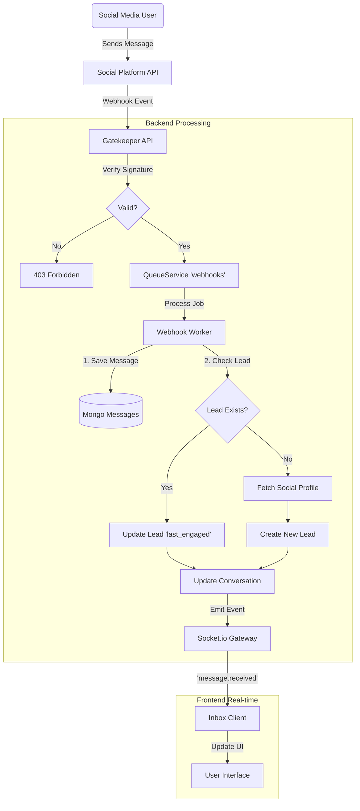
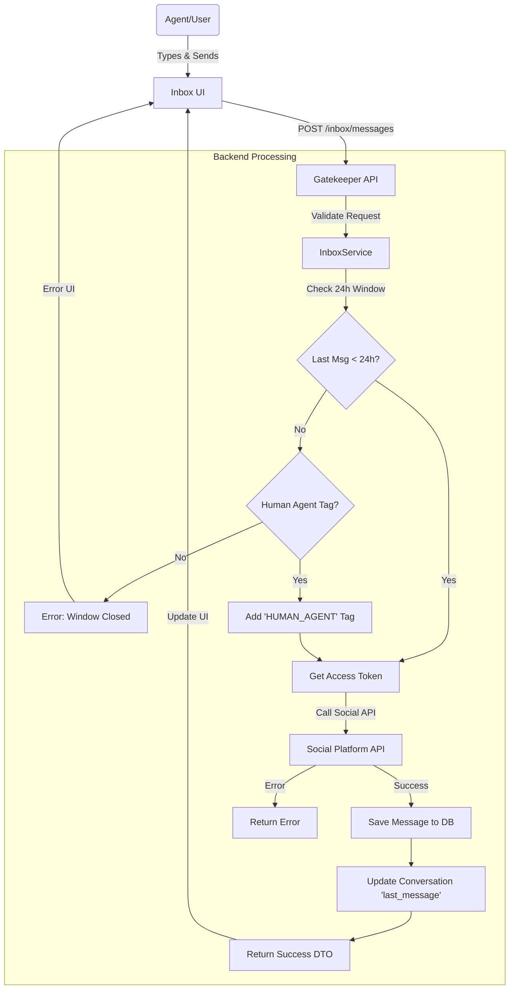
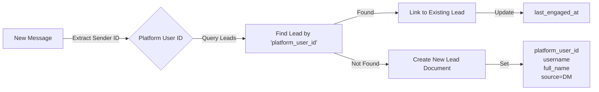

# Unified Social Inbox & Lead Management Implementation Plan

## Overview

We need to build a "Unified Social Inbox" that aggregates messages from connected social accounts (Instagram, Facebook, etc.) and links them to "Leads" (Customers). This allows for a CRM-like experience where we can track customer interactions across different platforms.

## Core Concepts

1.  **Unified Inbox**: A single view for all conversations.
2.  **Lead Linking**: Automatically (or manually) linking a social media user (Platform ID) to a `Lead` entity in our system.
3.  **Contextual Side panel**: displaying Lead details while chatting.
4.  **24h Messaging Window**: Social platforms (specifically Instagram/Facebook) enforce a 24-hour window for standard replies. If the last user message was > 24h ago, standard replies will fail. We must validate this and show UI indicators.
5.  **Human Agent Tag**: To reply after 24h, we must use the `HUMAN_AGENT` tag. This extends the window (usually up to 7 days).
6.  **Read Receipts**: Webhook events don't mark messages as "Read" in the Instagram app. We must explicitly send a "mark seen" action when the agent views the conversation.

## 1. Backend Implementation (NestJS)

### A. Data Aggregation (Inbox Service)

We need a service that aggregates `Conversations` and enriches them with `Lead` data.

- **Location**: `apps/gatekeeper/src/modules/inbox` (New Module) or extend `messaging`.
- **New Endpoints**:
  - `GET /inbox/conversations`:
    - **Filters**: `status` (open/closed), `platform` (instagram, etc.), `social_account_id`.
    - **Logic**:
      1.  Fetch `MongoConversationDocument` based on filters.
      2.  For each conversation, extract `participants`.
      3.  Find `MongoLeadDocument` where `platform_user_id` matches participant ID.
      4.  Return combined object: `Conversation + Lead + LastMessage`.
  - `GET /inbox/conversations/:id/messages`:
    - Fetch messages for a specific conversation.
  - `POST /inbox/conversations/:id/link-lead`:
    - Manually link a conversation to a specific Lead (if auto-matching fails).
  - `POST /inbox/conversations/:id/read`:
    - Mark conversation as read (send `sender_action: mark_seen` to platform).

### B. Lead Association Logic

- **Auto-Creation**: When a new message arrives (webhook), check if `MongoLeadDocument` exists for `sender_id`.
  - If yes, update `last_engaged`.
  - If no, create new `MongoLeadDocument` using profile info from the message/social API.

## 2. Frontend Implementation (Next.js)

### A. Route Structure

- New Route: `/dashboard/inbox`
  - `layout.tsx`: The 3-pane layout provider.
  - `page.tsx`: The main view.

### B. UI Components (The 3-Pane Layout)

#### 1. Left Sidebar: Conversation List

- **Header**: Filters (All, Unread, Done), Social Account Switcher.
- **List Item**:
  - Avatar (User's profile pic).
  - Name (from Lead or Social User).
  - Platform Icon (Instagram, FB logo).
  - Last Message Preview.
  - Time ago.
  - Unread Badge.

#### 2. Middle Pane: Chat Interface

- **Header**: User Name, Platform Icon, "Resolve/Archive" button.
- **Message List**:
  - Incoming/Outgoing bubbles.
  - Attachment support (Images, Videos).
  - "Read" status indicators.
- **Input Area**:
  - Text area.
  - Emoji picker.
  - Attachment button.
  - "Send" button.
  - **24h Window Indicator**: If window closed, show warning.
  - **Human Agent Tag**: If window closed, enable sending with "Human Agent" tag (possibly automatic or via toggle).

#### 3. Right Pane: CRM / Lead Context

- **Profile Section**: Large Avatar, Name, Handle, Bio.
- **Lead Details**:
  - Status/Tags (e.g., "New Lead", "VIP").
  - Notes (Internal notes about the customer).
  - Contact Info (Email, Phone if available).
  - "View Full Profile" link to Lead page.

## 3. Detailed Todo List

### Backend Tasks

- [x] **Create InboxModule**: Scaffold new module in `gatekeeper`.
- [x] **DTOs**: Define `GetInboxConversationsDto` (Completed), `InboxConversationResponseDto` (via Transformer).
- [x] **Service Method `getConversations`**: Implement aggregation pipeline (Lookup Conversations -> Lookup Last Message -> Lookup Lead).
- [ ] **Service Method `getMessages`**: Fetch messages with pagination.
- [ ] **Update Webhook Handler**: Ensure Leads are created/updated on incoming messages.
- [ ] **Validate 24h Window**: In `sendMessage`, check if `last_incoming_message_at` > 24h.
- [ ] **Implement `HUMAN_AGENT` Tag**: If > 24h, automatically apply `tag: HUMAN_AGENT` if configured.
- [ ] **Implement Read Receipts**: Add endpoint to send `mark_seen` to social platform.

### Frontend Tasks

- [ ] **Setup Route**: Create `app/dashboard/inbox/page.tsx` and `layout.tsx`.
- [ ] **API Client**: Add methods to `lib/api` for fetching inbox data.
- [ ] **State Management**: Create `InboxContext` or use Query for managing selected conversation.
- [ ] **Component: `InboxSidebar`**:
  - Implement virtualized list for performance.
  - Add filters.
- [ ] **Component: `ChatWindow`**:
  - Message bubbles component.
  - Input component with optimistic updates.
  - **Implement 24h Window Logic**: Show warning if conversation is expired; handle `HUMAN_AGENT` tag flow.
  - **Send Read Receipt**: Trigger API call when chat is opened/focused.
- [ ] **Component: `LeadSidebar`**:
  - Display Lead details.
  - Allow editing Tags/Notes.

### UX/UI Polish

- [ ] **Empty States**: "Select a conversation to start chatting".
- [ ] **Loading Skeletons**: For list and chat window.
- [ ] **Responsive Design**: Hide right pane on smaller screens, collapsible sidebar.

## 4. Architecture & Data Flow

### A. Incoming Message Flow (Webhook -> Inbox)

This flow describes what happens when a customer sends a message on a social platform (e.g., Instagram).

### B. Outgoing Message Flow (Inbox -> Social Platform)

This flow describes what happens when an agent replies from the Unified Inbox.

### C. Lead Linking Logic

How we connect a Social ID to a CRM Lead.

